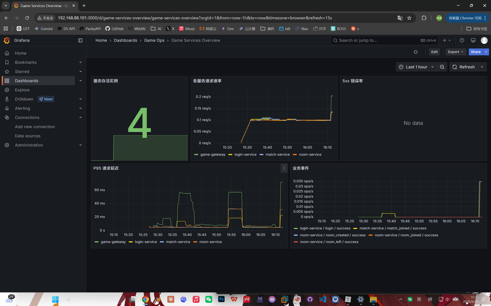
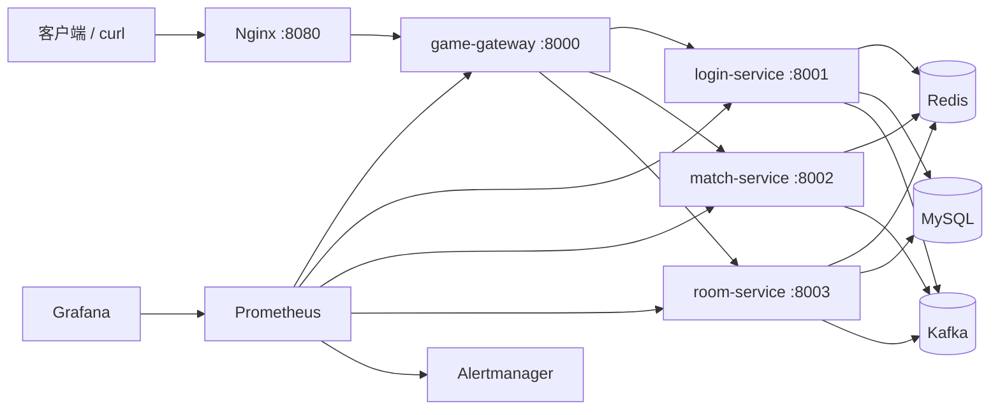

# game-k8s-ops-practice

一个面向运维工程师、DevOps 工程师和游戏运维岗位的云原生实战项目。项目用四个小型 FastAPI 服务模拟登录、匹配和房间业务，重点展示容器化、Kubernetes 发布、监控告警、日志排查和版本回滚。

本项目是运维练习环境，不是完整游戏服务端，也不具备商业生产系统的容量、可靠性或安全性。

### 个人操作完整记录：[docs_操作记录](./docs_操作记录/)

### 个人故障排查记录：[failure-drills](./failure-drills/)

## 项目背景

游戏运维岗位通常需要理解业务调用链，但工作重点并不是实现复杂玩法，而是保证服务能够部署、观测、排障和回退。本项目保留一条足够真实的业务链路：

1. 玩家通过网关登录，MySQL 校验账号，Redis 保存会话和在线状态。
2. 在线玩家加入匹配队列，Redis Sorted Set 保存排队顺序。
3. 玩家创建或加入房间，Redis 保存临时状态，MySQL 保存房间记录。
4. 登录、匹配、房间和异常事件发送到 Kafka。
5. Prometheus 抓取四个服务的指标，Grafana 展示请求量、错误率和延迟，Alertmanager 接收告警。

这套设计刻意保持规模适中，适合在个人电脑、虚拟机、Minikube、Kind 或测试 Kubernetes 集群中练习。

## 实践成果展示

### 监控指标与 Grafana 看板

Prometheus 持续抓取四个 FastAPI 服务的请求量、状态码、延迟和业务事件指标，Grafana 自动加载项目内置 Dashboard，用于观察服务存活、请求速率、5xx 错误率和 P95 延迟。

[](./docs_操作记录/02Prometheus%20Grafana%20Alertmanager验证记录.md)

### Kubernetes 错误发布与版本回滚

通过发布不存在的 `login-service:9.9.9` 模拟异常版本，观察 Deployment 滚动更新超时、Pod 镜像拉取失败和旧副本可用性保护，随后使用 `kubectl rollout undo` 回滚到上一可用版本，并通过登录接口完成恢复验证。

[](./docs_操作记录/04Kubernetes%20发布与回滚.md)

完整过程可查看：

- [个人操作完整记录](./docs_操作记录/)
- [个人故障排查记录](./failure-drills/)

## 项目架构



### 服务职责

| 服务 | 端口 | 职责 |
| --- | ---: | --- |
| game-gateway | 8000 | 统一业务入口、请求转发、Request ID |
| login-service | 8001 | 登录、退出、会话和在线状态 |
| match-service | 8002 | 匹配排队和排队状态 |
| room-service | 8003 | 创建、加入、离开和查询房间 |
| Nginx | 8080 | 本地反向代理入口 |

每个 FastAPI 服务都提供：

- `GET /health`：检查 Redis、MySQL 和 Kafka 依赖状态。
- `GET /metrics`：输出 Prometheus 指标。
- `GET /docs`：FastAPI 自动生成的接口文档。

## 技术栈

- Python 3.12、FastAPI、Uvicorn
- Redis：在线状态、登录会话、匹配队列、房间临时状态
- MySQL 8.4：用户、登录记录、房间、房间玩家记录
- Kafka 3.9（KRaft 单节点）：业务行为与异常事件
- Docker、Docker Compose、Nginx
- Kubernetes：Namespace、ConfigMap、Secret、Deployment、Service、Ingress、PVC
- Prometheus、Grafana、Alertmanager
- Bash、curl、kubectl

## 目录结构

```text
.
├── common/                         # 公共配置、日志、指标与基础设施客户端
├── services/                       # 四个 FastAPI 业务服务及 Dockerfile
│   ├── game-gateway/               # API 网关及独立 Dockerfile
│   ├── login-service/              # 登录、退出、会话与在线状态
│   ├── match-service/              # 匹配队列与匹配状态
│   └── room-service/               # 房间创建、加入、离开与查询
├── mysql/                          # MySQL 初始化 SQL
├── nginx/                          # Nginx 反向代理配置
├── monitoring/                     # 监控、看板与告警配置
│   ├── prometheus/                 # 抓取配置与告警规则
│   ├── grafana/                    # 数据源与 Dashboard
│   └── alertmanager/               # 告警路由示例
├── k8s/                            # 应用、基础设施、监控与 Ingress 清单
├── scripts/                        # 构建、部署、检查、回滚与清理脚本
├── docs_操作记录/                  # Compose、监控、K8s、回滚实操记录与截图
├── failure-drills/                 # 一个故障场景一份排障文档
├── docs_assets/                    # README 展示图片
├── docker-compose.yml              # 本地完整技术栈编排
├── requirements.txt                # Python 依赖
├── Makefile                        # 常用操作入口
├── .env.example                    # 环境变量示例
└── README.md
```

## 本地 Docker Compose 部署

### 环境要求

- Docker Engine 24+ 或 Docker Desktop
- Docker Compose v2
- curl
- 建议至少分配 4 CPU、8 GB 内存

### 启动

```bash
git clone <your-repository-url>
cd game-k8s-ops-practice
cp .env.example .env
bash scripts/deploy-compose.sh
```

首次启动需要下载镜像并初始化 MySQL，通常要等待几十秒。查看状态：

```bash
docker compose ps
bash scripts/health-check.sh
```

访问地址：

| 组件 | 地址 |
| --- | --- |
| Nginx 业务入口 | http://localhost:8080 |
| Gateway Swagger | http://localhost:8000/docs |
| Prometheus | http://localhost:9090 |
| Alertmanager | http://localhost:9093 |
| Grafana | http://localhost:3000 |

Grafana 默认账号为 `admin/admin`，仅用于本地练习。公开部署前必须修改 `.env` 和 Kubernetes Secret。

### 业务调用示例

演示账号：

- `admin / admin123`
- `player1 / player123`

登录：

```bash
curl -sS -X POST http://localhost:8080/login \
  -H 'Content-Type: application/json' \
  -d '{"username":"admin","password":"admin123"}'
```

记录返回的 `token` 和 `player_id`。加入匹配：

```bash
curl -sS -X POST http://localhost:8080/match \
  -H 'Content-Type: application/json' \
  -d '{"player_id":1,"mode":"ranked"}'

curl -sS 'http://localhost:8080/match/status?player_id=1&mode=ranked'
```

创建房间：

```bash
curl -sS -X POST http://localhost:8080/room/create \
  -H 'Content-Type: application/json' \
  -d '{"owner_id":1,"max_players":4}'
```

使用返回的 `room_id` 查询、加入和离开：

```bash
curl -sS "http://localhost:8080/room/status?room_id=<room_id>"

curl -sS -X POST http://localhost:8080/room/join \
  -H 'Content-Type: application/json' \
  -d '{"room_id":"<room_id>","player_id":2}'

curl -sS -X POST http://localhost:8080/room/leave \
  -H 'Content-Type: application/json' \
  -d '{"room_id":"<room_id>","player_id":2}'
```

退出：

```bash
curl -sS -X POST http://localhost:8080/logout \
  -H 'Content-Type: application/json' \
  -d '{"token":"<login_token>"}'
```

### 停止与清理

```bash
# 删除容器和网络，保留数据卷
bash scripts/clean.sh compose

# 同时删除 MySQL、Redis、Kafka、Prometheus、Grafana 数据
bash scripts/clean.sh compose-volumes
```

## Kubernetes 部署

### 环境要求

- 可用 Kubernetes 集群
- kubectl
- Ingress Nginx Controller
- 默认 StorageClass
- 集群节点能够拉取清单中的公共镜像

应用镜像默认为：

```text
game-k8s-ops-practice/game-gateway:1.0.0
game-k8s-ops-practice/login-service:1.0.0
game-k8s-ops-practice/match-service:1.0.0
game-k8s-ops-practice/room-service:1.0.0
```

先构建镜像：

```bash
IMAGE_REGISTRY=game-k8s-ops-practice IMAGE_TAG=1.0.0 \
  bash scripts/build-images.sh
```

本地集群需要把镜像导入节点。例如：

```bash
# Minikube
minikube image load game-k8s-ops-practice/game-gateway:1.0.0
minikube image load game-k8s-ops-practice/login-service:1.0.0
minikube image load game-k8s-ops-practice/match-service:1.0.0
minikube image load game-k8s-ops-practice/room-service:1.0.0

# Kind
kind load docker-image game-k8s-ops-practice/game-gateway:1.0.0
kind load docker-image game-k8s-ops-practice/login-service:1.0.0
kind load docker-image game-k8s-ops-practice/match-service:1.0.0
kind load docker-image game-k8s-ops-practice/room-service:1.0.0
```

部署：

```bash
bash scripts/deploy-k8s.sh
kubectl -n game-ops get pods,svc,ingress
```

将 `game.local` 指向 Ingress 地址：

```text
<INGRESS_IP> game.local
```

测试：

```bash
curl http://game.local/health
```

如果没有 Ingress Controller，可临时端口转发：

```bash
kubectl -n game-ops port-forward service/game-gateway 8000:8000
kubectl -n game-ops port-forward service/grafana 3000:3000
```

Kubernetes 中的 MySQL、Redis 和 Kafka 都是单实例练习配置，不代表生产高可用方案。实际环境通常使用托管数据库、中间件集群、Operator 或独立基础设施团队提供的服务。

## 监控告警

应用提供以下自定义指标：

| 指标 | 含义 |
| --- | --- |
| `game_http_requests_total` | 按服务、方法、路径和状态码统计请求 |
| `game_http_request_duration_seconds` | 请求耗时直方图 |
| `game_business_events_total` | 登录、匹配、房间等业务事件 |

Prometheus 规则示例：

- 服务连续 1 分钟无法抓取：`GameServiceDown`
- 5xx 错误率连续 5 分钟超过 5%：`GameServiceHighErrorRate`
- P95 延迟连续 5 分钟超过 1 秒：`GameServiceHighLatency`
- 登录失败事件突增：`LoginFailureSpike`

Grafana 会自动加载 `Game Services Overview` Dashboard。Alertmanager 的 Compose webhook 是占位地址，实际使用时应替换为企业微信、钉钉、飞书或内部告警网关，并配置静默、路由和抑制策略。

手动验证告警的一种方式：

```bash
docker compose stop login-service
```

等待超过一分钟，在 Prometheus `Alerts` 页面确认告警状态；恢复服务：

```bash
docker compose start login-service
```

## 日志排查

四个服务将结构化 JSON 日志输出到标准输出，容器平台负责采集。常用字段包括时间、级别、服务、事件、玩家和 Request ID。

Compose 快速筛选最近 30 分钟的错误：

```bash
bash scripts/log-check.sh compose
bash scripts/log-check.sh compose login-service
```

Kubernetes 排查：

```bash
bash scripts/log-check.sh k8s login-service
kubectl -n game-ops describe pod <pod-name>
kubectl -n game-ops logs <pod-name> --previous
kubectl -n game-ops get events --sort-by=.lastTimestamp
```

建议的排查顺序：

1. 检查 Ingress、Service、Endpoints 和 Pod 是否正常。
2. 查看 readiness/liveness Probe、重启次数和事件。
3. 根据 Request ID 串联网关与后端日志。
4. 检查 Redis、MySQL、Kafka 的连接错误和超时。
5. 对照 Prometheus 的错误率、P95 延迟和服务存活指标。
6. 确认故障是否与最近一次发布时间一致。

示例场景：

- 登录返回 401：先确认演示账号，再查看 `login_records` 是否记录失败。
- 登录返回 502：查看网关日志和 `login-service` Endpoints。
- `/health` 为 `degraded`：根据响应中的 `redis/mysql/kafka` 字段定位依赖。
- 房间查询 404：Redis 临时房间可能过期，继续核对 MySQL 历史记录。
- Kafka 写入异常：检查 broker 存活、DNS、端口和元数据更新错误。

## 版本发布与回滚

### Compose 发布

```bash
IMAGE_TAG=1.1.0 bash scripts/build-images.sh
IMAGE_TAG=1.1.0 docker compose up -d --no-deps game-gateway
docker compose logs -f game-gateway
```

Compose 没有 Kubernetes Deployment 的 revision 机制。回滚时明确指定旧标签重新启动：

```bash
IMAGE_TAG=1.0.0 docker compose up -d --no-deps game-gateway
```

### Kubernetes 滚动发布

```bash
kubectl -n game-ops set image deployment/login-service \
  login-service=game-k8s-ops-practice/login-service:1.1.0

kubectl -n game-ops rollout status deployment/login-service
kubectl -n game-ops rollout history deployment/login-service
```

回滚到上一版本：

```bash
bash scripts/rollback.sh login-service
```

回滚到指定 revision：

```bash
bash scripts/rollback.sh login-service 2
```

发布检查点应至少包括：

- 新 Pod readiness 通过；
- 旧 Pod 在新 Pod 就绪后退出；
- 5xx、P95 延迟和重启次数没有异常上升；
- 登录、匹配、房间核心接口冒烟测试通过；
- Kafka 事件仍能正常写入；
- 数据库变更与应用版本兼容。

## Shell 脚本

| 脚本 | 用途 |
| --- | --- |
| `build-images.sh` | 构建四个应用镜像 |
| `deploy-compose.sh` | 校验并启动 Compose |
| `deploy-k8s.sh` | 创建配置并部署 Kubernetes 资源 |
| `health-check.sh` | 检查四个服务健康接口 |
| `log-check.sh` | 筛选 Compose 或 Kubernetes 错误日志 |
| `rollback.sh` | 回滚 Kubernetes Deployment |
| `clean.sh` | 清理 Compose 或 Kubernetes 环境 |

## 常见问题

### 1. 应用容器不断重启

四个应用在启动阶段连接 Redis、MySQL 和 Kafka。先检查依赖容器或 Pod：

```bash
docker compose ps
docker compose logs mysql redis kafka
```

Kubernetes 中检查：

```bash
kubectl -n game-ops get pods
kubectl -n game-ops describe pod <app-pod>
```

### 2. MySQL 初始化 SQL 没有再次执行

MySQL 官方镜像只在空数据目录首次初始化时执行 `/docker-entrypoint-initdb.d`。本地需要重新初始化时：

```bash
bash scripts/clean.sh compose-volumes
bash scripts/deploy-compose.sh
```

这会删除数据，执行前确认环境用途。

### 3. Kubernetes 显示 ImagePullBackOff

本地镜像没有自动进入 Minikube 或 Kind 节点。按前文执行 `minikube image load` 或 `kind load docker-image`。远程集群应推送到可访问的镜像仓库，并修改 `k8s/apps.yaml` 中的镜像地址。

### 4. `game.local` 无法访问

确认 Ingress Controller 已安装、Ingress 有地址，并配置本机 hosts。也可使用 `kubectl port-forward` 绕过 Ingress 验证应用。

### 5. Grafana 没有数据

检查 Prometheus Targets 页面是否能抓取四个服务，再确认 Grafana 数据源指向 `http://prometheus:9090`。刚启动时需要先产生一些业务请求。

### 6. Alertmanager webhook 报连接失败

默认 webhook 是演示占位地址。请修改 `monitoring/alertmanager/alertmanager.yml`，或在只验证告警状态时暂时忽略通知发送失败。

### 7. 为什么 Secret 中仍是明文

Kubernetes Secret 的 `stringData` 便于练习和代码审阅，但不适合真实仓库保存敏感值。实际环境应使用 External Secrets、Sealed Secrets、Vault、云厂商密钥服务或 CI/CD 注入。

### 8. Docker Hub 镜像拉取失败

如果执行：

```bash
bash scripts/deploy-compose.sh
```

时出现类似错误：

```
failed to resolve reference "docker.io/prom/alertmanager:v0.28.1"
dial tcp registry-1.docker.io:443: connect: connection refused
```

说明当前服务器无法正常访问 Docker Hub，不是项目代码或 Compose 配置错误。

## 免责声明

本项目用于学习。默认账号、密码、单节点中间件、明文配置及资源规格均针对本地练习，不应直接用于生产环境。
