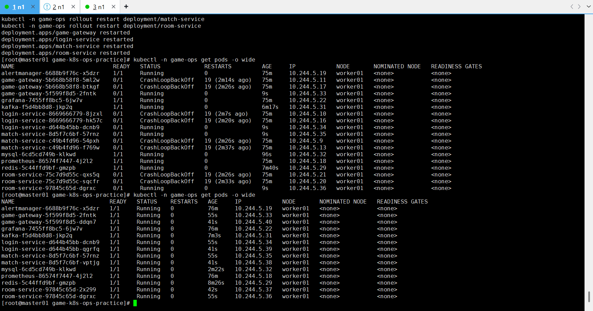
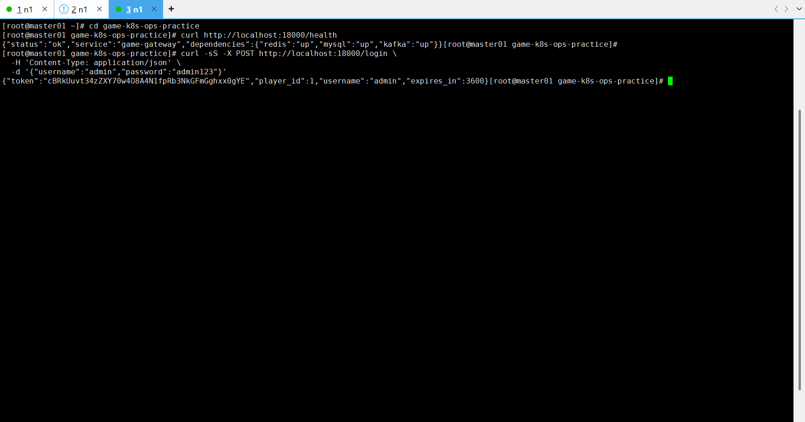
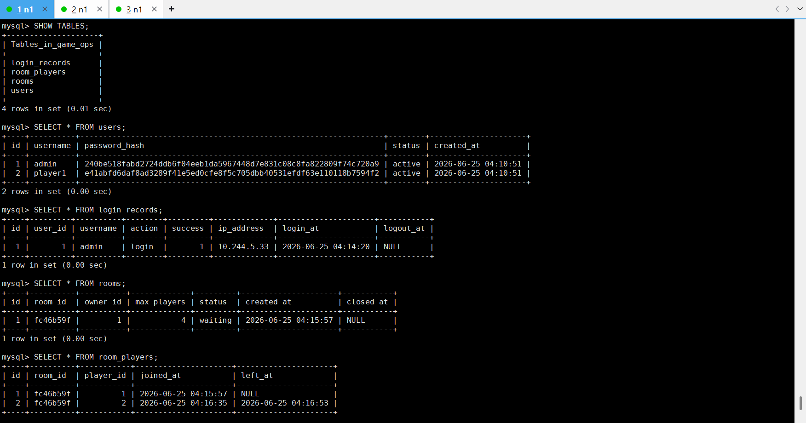
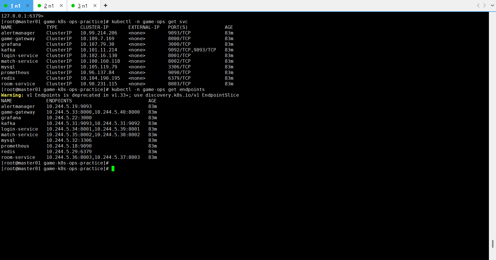

---

---

# Kubernetes 部署与排查记录

## 一、记录说明

本文档记录 `game-k8s-ops-practice` 项目在 Kubernetes 环境中的部署、问题排查、镜像处理、基础组件恢复、业务服务验证、MySQL 数据验证、Redis 状态验证、Service 与 Endpoints 验证过程。

本阶段目标是将已经在 Docker Compose 环境中跑通的模拟游戏业务服务部署到 Kubernetes 集群中，并验证 Kubernetes 环境下的登录、匹配、房间管理等核心业务链路。

------

## 二、Kubernetes 环境信息

### 1. 集群节点状态

执行命令：

```bash
kubectl get nodes -o wide
```

节点状态如下：

```text
master01.itcast.cn   Ready      control-plane   192.168.88.101   containerd://2.2.4
worker01             Ready      <none>          192.168.88.102   containerd://2.2.4
```

### 2. 当前可用节点

本次部署主要调度到：

```text
worker01
```

### 3. 容器运行时

执行命令：

```bash
kubectl get nodes -o jsonpath='{range .items[*]}{.metadata.name}{"\t"}{.status.nodeInfo.containerRuntimeVersion}{"\n"}{end}'
```

结果显示集群使用：

```text
containerd
```

### 4. StorageClass

执行命令：

```bash
kubectl get sc
```

结果：

```text
local-path (default)
```

### 5. IngressClass

执行命令：

```bash
kubectl get ingressclass
```

结果：

```text
nginx
```

------

## 三、Kubernetes 清单检查

### 1. K8s 文件目录

执行命令：

```bash
ls -l k8s
```

主要文件包括：

```text
applications.yaml
configmap.yaml
infra.yaml
ingress.yaml
kustomization.yaml
monitoring.yaml
namespace.yaml
secret.yaml
configs/
```

### 2. 业务镜像检查

执行命令：

```bash
grep -Rni "image:\|imagePullPolicy\|storageClassName\|game.local\|host:" k8s
```

业务服务镜像如下：

```text
game-k8s-ops-practice/game-gateway:1.0.0
game-k8s-ops-practice/login-service:1.0.0
game-k8s-ops-practice/match-service:1.0.0
game-k8s-ops-practice/room-service:1.0.0
```

业务镜像拉取策略为：

```yaml
imagePullPolicy: IfNotPresent
```

### 3. 中间件镜像

中间件镜像包括：

```text
swr.cn-north-4.myhuaweicloud.com/ddn-k8s/docker.io/library/mysql:8.4.5
swr.cn-north-4.myhuaweicloud.com/ddn-k8s/docker.io/library/redis:7.4.2-alpine
swr.cn-north-4.myhuaweicloud.com/ddn-k8s/docker.io/apache/kafka:3.9.1
```

------

## 四、业务镜像导入 containerd

### 1. 问题背景

当前 Kubernetes 集群使用 `containerd` 作为容器运行时，因此 Docker 本地构建出来的镜像并不会自动出现在 Kubernetes 节点的 `containerd` 镜像空间中。

如果不提前导入镜像，业务 Pod 可能出现：

```text
ImagePullBackOff
ErrImagePull
```

### 2. 镜像导入方式

将业务镜像打包为 tar 包，并导入到 `worker01` 的 containerd `k8s.io` 命名空间中。

执行镜像导入后，在 `worker01` 上检查：

```bash
ctr -n k8s.io images list | grep game-k8s-ops-practice
```

结果显示业务镜像已存在：

```text
docker.io/game-k8s-ops-practice/game-gateway:1.0.0
docker.io/game-k8s-ops-practice/login-service:1.0.0
docker.io/game-k8s-ops-practice/match-service:1.0.0
docker.io/game-k8s-ops-practice/room-service:1.0.0
```

### 3. 验证结论

业务镜像已成功导入 Kubernetes 节点，后续 Pod 使用 `imagePullPolicy: IfNotPresent` 时，可以直接使用节点本地镜像。

------

## 五、首次部署与 Ingress 问题

### 1. 执行部署

执行项目部署脚本后，大部分资源创建成功，但 Ingress 创建失败。

### 2. Ingress 报错信息

```text
failed calling webhook "validate.nginx.ingress.kubernetes.io":
service "ingress-nginx-controller-admission" not found
```

### 3. 原因分析

该问题不是业务服务本身的问题，而是集群中 ingress-nginx 的 admission webhook 配置异常或残留。

当前集群中存在 IngressClass：

```text
nginx
```

但 admission webhook 所需的 service 不存在：

```text
ingress-nginx-controller-admission
```

导致创建 Ingress 时被 webhook 拦截。

### 4. 临时处理方式

本阶段先不修复 Ingress，而是使用 `port-forward` 验证 Kubernetes 内部业务链路。

后续可单独处理 Ingress Controller 安装或 webhook 配置问题。

------

## 六、问题一：MySQL PVC Pending

### 1. 现象

### 


执行：

```bash
kubectl -n game-ops get pvc
```

发现：

```text
mysql-data   Pending   local-path
```

MySQL Pod 也处于 Pending 状态。

### 2. 排查命令

```bash
kubectl -n game-ops describe pod -l app=mysql
kubectl -n game-ops get events --sort-by=.lastTimestamp | tail -80
```

### 3. 关键事件

事件中出现：

```text
failed to provision volume with StorageClass "local-path":
failed to create volume ... create process timeout after 120 seconds
```

### 4. 原因分析

项目中的 MySQL 使用 PVC 保存数据，PVC 依赖默认 StorageClass `local-path`。

当前环境中 local-path provisioner 创建本地卷超时，导致 PVC 一直 Pending，MySQL 无法启动。

由于 MySQL 没有启动，业务服务连接 MySQL 失败，进而出现 CrashLoopBackOff。

### 5. 解决方式

当前项目是练习环境，不是生产环境。为了优先跑通 Kubernetes 主业务链路，将 MySQL 的数据卷从 PVC 临时改为 `emptyDir`。

修改前：

```yaml
volumes:
  - name: data
    persistentVolumeClaim:
      claimName: mysql-data
```

修改后：

```yaml
volumes:
  - name: data
    emptyDir: {}
```

然后执行：

```bash
kubectl -n game-ops delete pod -l app=mysql
kubectl -n game-ops delete pvc mysql-data
kubectl apply -f k8s/infra.yaml
```

### 6. 验证结果

再次查看 MySQL Pod：

```bash
kubectl -n game-ops describe pod -l app=mysql
```

可以看到：

```text
data:
  Type: EmptyDir
```

说明 MySQL 已经不再依赖 PVC。

### 7. 总结

该问题属于 Kubernetes 存储侧问题。为了演示环境快速跑通，使用 `emptyDir` 绕过 local-path provisioner 问题是合理的临时方案。

生产环境中不建议 MySQL 使用 `emptyDir`，应使用稳定的持久化存储或外部数据库服务。

------

## 七、问题二：Redis ImagePullBackOff

### 1. 现象


Redis Pod 处于：

```text
ImagePullBackOff
```

### 2. 排查命令

```bash
kubectl -n game-ops describe pod -l app=redis
```

### 3. 关键报错

```text
Failed to pull image "swr.cn-north-4.myhuaweicloud.com/ddn-k8s/docker.io/library/redis:7.4.2-alpine"
not found
Error: ErrImagePull
Error: ImagePullBackOff
```

### 4. 原因分析

K8s 清单中的 Redis 镜像地址为：

```text
swr.cn-north-4.myhuaweicloud.com/ddn-k8s/docker.io/library/redis:7.4.2-alpine
```

但该镜像地址无法正常拉取，提示 `not found`。

### 5. 解决方式

将 Docker Compose 阶段已经使用过的 Redis 镜像重新打上 K8s 清单中需要的标签，然后导出并导入到 worker01 的 containerd 中。

示例操作：

```bash
docker tag redis:7.4.2-alpine \
  swr.cn-north-4.myhuaweicloud.com/ddn-k8s/docker.io/library/redis:7.4.2-alpine
docker save -o redis-k8s.tar \
  swr.cn-north-4.myhuaweicloud.com/ddn-k8s/docker.io/library/redis:7.4.2-alpine
scp redis-k8s.tar root@192.168.88.102:/root/
```

在 worker01 上导入：

```bash
ctr -n k8s.io images import /root/redis-k8s.tar
```

重新创建 Redis Pod：

```bash
kubectl -n game-ops delete pod -l app=redis
```

### 6. 验证结果

后续 Redis 状态恢复为：

```text
redis-xxxxx   1/1   Running
```

------

## 八、问题三：MySQL 镜像拉取失败

### 1. 现象


在绕过 PVC 后，MySQL Pod 一度出现：

```text
ImagePullBackOff
```


### 2. 原因

MySQL 使用的镜像为：

```text
swr.cn-north-4.myhuaweicloud.com/ddn-k8s/docker.io/library/mysql:8.4.5
```

该镜像在 Kubernetes 节点上未提前存在，并且远程拉取不稳定或失败。

### 3. 解决方式

将本地 MySQL 镜像按 K8s YAML 中的镜像名重新打标签、保存并导入 worker01 的 containerd。

示例：

```bash
docker tag mysql:8.4.5 \
  swr.cn-north-4.myhuaweicloud.com/ddn-k8s/docker.io/library/mysql:8.4.5
docker save -o mysql-k8s.tar \
  swr.cn-north-4.myhuaweicloud.com/ddn-k8s/docker.io/library/mysql:8.4.5
scp mysql-k8s.tar root@192.168.88.102:/root/
```

在 worker01 上导入：

```bash
ctr -n k8s.io images import /root/mysql-k8s.tar
```

重建 MySQL Pod：

```bash
kubectl -n game-ops delete pod -l app=mysql
```

### 4. 验证结果

后续 MySQL 状态恢复为：

```text
mysql-xxxxx   1/1   Running
```

------

## 九、问题四：Kafka CrashLoopBackOff

### 1. 现象

Kafka 镜像可以拉取并启动，但曾出现：

```text
CrashLoopBackOff
```

### 2. 排查命令

```bash
kubectl -n game-ops logs deployment/kafka --previous --tail=100
```

### 3. 关键日志

日志中出现 Kafka 启动失败和 shutdown 相关信息：

```text
Received a fatal error while waiting for the controller to acknowledge that we are caught up
```

### 4. 原因分析

当前 Kafka 使用单节点 KRaft 模式。在 Kubernetes 单 Pod 练习环境中，controller quorum voter 配置需要与实际监听方式匹配。

原配置中使用：

```text
1@kafka:9093
```

该配置在当前环境中可能导致 Kafka Controller 启动阶段无法正常完成确认。

### 5. 解决方式

将 Kafka 环境变量中的：

```text
KAFKA_CONTROLLER_QUORUM_VOTERS=1@kafka:9093
```

调整为：

```text
KAFKA_CONTROLLER_QUORUM_VOTERS=1@localhost:9093
```

然后执行：

```bash
kubectl apply -f k8s/infra.yaml
kubectl -n game-ops rollout restart deployment/kafka
```

### 6. 验证结果

后续 Kafka 状态恢复为：

```text
kafka-xxxxx   1/1   Running
```

------

## 十、重启业务服务

在 MySQL、Redis、Kafka 均正常后，重启四个业务服务：

```bash
kubectl -n game-ops rollout restart deployment/game-gateway
kubectl -n game-ops rollout restart deployment/login-service
kubectl -n game-ops rollout restart deployment/match-service
kubectl -n game-ops rollout restart deployment/room-service
```

### 1. 初始观察

刚重启时，新旧 Pod 会同时存在，旧 Pod 仍可能处于 CrashLoopBackOff，新 Pod 逐步变为 Running。

### 2. 最终状态



再次查看：

```bash
kubectl -n game-ops get pods -o wide
```

最终核心 Pod 均恢复为：

```text
alertmanager    1/1 Running
game-gateway    1/1 Running
grafana         1/1 Running
kafka           1/1 Running
login-service   1/1 Running
match-service   1/1 Running
mysql           1/1 Running
prometheus      1/1 Running
redis           1/1 Running
room-service    1/1 Running
```

其中业务服务均为两个副本：

```text
game-gateway    2 replicas
login-service   2 replicas
match-service   2 replicas
room-service    2 replicas
```

------

## 十一、Kubernetes 主链路验证

### 1. 使用 port-forward 暴露 game-gateway

由于 Ingress 当前存在 admission webhook 问题，本阶段使用 port-forward 验证 K8s 内部服务链路。

执行：

```bash
kubectl -n game-ops port-forward service/game-gateway 18000:8000 --address 0.0.0.0
```

后续通过：

```text
http://localhost:18000
```

访问 K8s 中的 game-gateway。




------

## 十二、健康检查验证

### 1. 执行命令

```bash
curl http://localhost:18000/health
```

### 2. 返回结果

```json
{
  "status": "ok",
  "service": "game-gateway",
  "dependencies": {
    "redis": "up",
    "mysql": "up",
    "kafka": "up"
  }
}
```

### 3. 验证结论

Kubernetes 中的 game-gateway 可以正常访问，并且能够连接 Redis、MySQL、Kafka。

------

## 十三、登录接口验证

### 1. 执行命令

```bash
curl -sS -X POST http://localhost:18000/login \
  -H 'Content-Type: application/json' \
  -d '{"username":"admin","password":"admin123"}'
```

### 2. 返回结果


```json
{
  "token": "cBRkUuvt34zZXY70w408A4N1fpRb3NkGFmGghxx0gYE",
  "player_id": 1,
  "username": "admin",
  "expires_in": 3600
}
```

### 3. 验证结论

Kubernetes 环境下登录接口验证成功，说明以下链路正常：

```text
port-forward
  ↓
service/game-gateway
  ↓
game-gateway Pod
  ↓
login-service
  ↓
MySQL / Redis / Kafka
```

------

## 十四、匹配接口验证

### 1. 加入匹配队列


执行命令：

```bash
curl -sS -X POST http://localhost:18000/match \
  -H 'Content-Type: application/json' \
  -d '{"player_id":1,"mode":"ranked"}'
```

返回结果：

```json
{
  "status": "queued",
  "player_id": 1,
  "mode": "ranked"
}
```

### 2. 查询匹配状态

执行命令：

```bash
curl -sS 'http://localhost:18000/match/status?player_id=1&mode=ranked'
```

返回结果：

```json
{
  "status": "queued",
  "player_id": 1,
  "mode": "ranked",
  "queue_position": 1,
  "waiting_seconds": 8
}
```

### 3. 验证结论

Kubernetes 环境下匹配接口验证成功，说明 match-service 能通过 Redis 维护匹配队列状态。

------

## 十五、房间接口验证

### 1. 创建房间


执行命令：

```bash
curl -sS -X POST http://localhost:18000/room/create \
  -H 'Content-Type: application/json' \
  -d '{"owner_id":1,"max_players":4}'
```

返回结果：

```json
{
  "room_id": "fc46b59f",
  "owner_id": 1,
  "max_players": 4,
  "status": "waiting",
  "created_at": "2026-06-25T04:15:57.847495+00:00"
}
```

### 2. 查询房间状态

执行命令：

```bash
curl -sS "http://localhost:18000/room/status?room_id=fc46b59f"
```

返回结果：

```json
{
  "room_id": "fc46b59f",
  "owner_id": 1,
  "max_players": 4,
  "status": "waiting",
  "created_at": "2026-06-25T04:15:57.847495+00:00",
  "players": [1],
  "player_count": 1
}
```

### 3. 加入房间

执行命令：

```bash
curl -sS -X POST http://localhost:18000/room/join \
  -H 'Content-Type: application/json' \
  -d '{"room_id":"fc46b59f","player_id":2}'
```

返回结果：

```json
{
  "message": "join success",
  "room_id": "fc46b59f",
  "player_id": 2
}
```

### 4. 离开房间

执行命令：

```bash
curl -sS -X POST http://localhost:18000/room/leave \
  -H 'Content-Type: application/json' \
  -d '{"room_id":"fc46b59f","player_id":2}'
```

返回结果：

```json
{
  "message": "leave success",
  "room_id": "fc46b59f",
  "player_id": 2
}
```

### 5. 验证结论

Kubernetes 环境下房间创建、查询、加入、离开流程验证成功。

------

## 十六、MySQL 数据验证

### 1. 进入 MySQL



执行命令：

```bash
kubectl -n game-ops exec -it deployment/mysql -- mysql -uroot -p
```

### 2. 查看业务表

执行：

```sql
SHOW TABLES;
```

结果：

```text
login_records
room_players
rooms
users
```

### 3. 查询 users 表

执行：

```sql
SELECT * FROM users;
```

结果包含：

```text
1 | admin   | active
2 | player1 | active
```

### 4. 查询 login_records 表

执行：

```sql
SELECT * FROM login_records;
```

结果包含：

```text
id | user_id | username | action | success | ip_address | login_at            | logout_at
1  | 1       | admin    | login  | 1       | 10.244.5.33 | 2026-06-25 04:14:20 | NULL
```

### 5. 查询 rooms 表

执行：

```sql
SELECT * FROM rooms;
```

结果包含：

```text
id | room_id  | owner_id | max_players | status  | created_at          | closed_at
1  | fc46b59f | 1        | 4           | waiting | 2026-06-25 04:15:57 | NULL
```

### 6. 查询 room_players 表

执行：

```sql
SELECT * FROM room_players;
```

结果包含：

```text
id | room_id  | player_id | joined_at           | left_at
1  | fc46b59f | 1         | 2026-06-25 04:15:57 | NULL
2  | fc46b59f | 2         | 2026-06-25 04:16:35 | 2026-06-25 04:16:53
```

### 7. 验证结论

Kubernetes 环境中的业务请求已成功写入 MySQL，说明登录记录、房间记录、房间玩家记录链路正常。

------

## 十七、Redis 数据验证

### 1. 进入 Redis

### 

执行命令：

```bash
kubectl -n game-ops exec -it deployment/redis -- redis-cli
```

### 2. 查看 Key

执行：

```bash
KEYS *
```

结果：

```text
match:queue
player:online:1
session:cBRkUuvt34zZXY70w408A4N1fpRb3NkGFmGghxx0gYE
room:fc46b59f
room:fc46b59f:players
```

### 3. Redis Key 说明

| Redis Key               | 作用           |
| ----------------------- | -------------- |
| `match:queue`           | 匹配队列       |
| `player:online:1`       | 玩家在线状态   |
| `session:*`             | 登录会话 token |
| `room:fc46b59f`         | 房间临时状态   |
| `room:fc46b59f:players` | 房间玩家列表   |

### 4. 验证结论

Kubernetes 环境中的 Redis 已成功保存登录会话、玩家在线状态、匹配队列和房间临时状态。

------

## 十八、Service 验证


### 1. 执行命令

```bash
kubectl -n game-ops get svc
```

### 2. 查询结果

```text
alertmanager    ClusterIP   10.99.214.206    9093/TCP
game-gateway    ClusterIP   10.109.7.169     8000/TCP
grafana         ClusterIP   10.107.79.30     3000/TCP
kafka           ClusterIP   10.101.11.214    9092/TCP,9093/TCP
login-service   ClusterIP   10.102.16.130    8001/TCP
match-service   ClusterIP   10.100.160.118   8002/TCP
mysql           ClusterIP   10.105.119.79    3306/TCP
prometheus      ClusterIP   10.96.137.84     9090/TCP
redis           ClusterIP   10.104.190.195   6379/TCP
room-service    ClusterIP   10.98.231.115    8003/TCP
```

### 3. 验证结论

所有核心组件均已创建 ClusterIP Service，Kubernetes 内部服务访问入口正常。

------

## 十九、Endpoints 验证


### 1. 执行命令

```bash
kubectl -n game-ops get endpoints
```

### 2. 查询结果

```text
alertmanager    10.244.5.19:9093
game-gateway    10.244.5.33:8000,10.244.5.40:8000
grafana         10.244.5.22:3000
kafka           10.244.5.31:9093,10.244.5.31:9092
login-service   10.244.5.34:8001,10.244.5.39:8001
match-service   10.244.5.35:8002,10.244.5.38:8002
mysql           10.244.5.32:3306
prometheus      10.244.5.18:9090
redis           10.244.5.29:6379
room-service    10.244.5.36:8003,10.244.5.37:8003
```

### 3. 验证结论

Service 已正确关联到后端 Pod IP，说明 Service selector 与 Pod label 匹配正常。

例如：

```text
game-gateway Service -> 两个 game-gateway Pod
login-service Service -> 两个 login-service Pod
match-service Service -> 两个 match-service Pod
room-service Service -> 两个 room-service Pod
```

这说明 Kubernetes 内部负载转发链路正常。

------

## 二十、本阶段完成情况

截至目前，Kubernetes 阶段已完成：

1. Kubernetes 集群基础环境检查。
2. StorageClass 与 IngressClass 检查。
3. 业务镜像导入 containerd。
4. 处理 Ingress admission webhook 异常，改用 port-forward 验证。
5. 处理 MySQL PVC Pending 问题，将练习环境 MySQL 数据卷改为 emptyDir。
6. 处理 Redis 镜像拉取失败问题。
7. 处理 MySQL 镜像拉取失败问题。
8. 处理 Kafka CrashLoopBackOff 问题。
9. 重启业务 Deployment。
10. 验证所有核心 Pod 为 `1/1 Running`。
11. 验证 `/health` 返回 Redis、MySQL、Kafka 均为 `up`。
12. 验证登录接口成功。
13. 验证匹配接口成功。
14. 验证房间创建、查询、加入、离开成功。
15. 验证 MySQL 数据写入成功。
16. 验证 Redis 临时状态写入成功。
17. 验证 Service 与 Endpoints 正常。

------

## 二十一、当前阶段总结

本阶段完成了 `game-k8s-ops-practice` 项目在 Kubernetes 环境下的部署、问题排查和主业务链路验证。

最终验证链路如下：

```text
curl localhost:18000
  ↓
kubectl port-forward
  ↓
service/game-gateway
  ↓
game-gateway Pod
  ↓
login-service / match-service / room-service
  ↓
MySQL / Redis / Kafka
```

Kubernetes 环境中已经可以正常完成：

```text
登录
匹配
创建房间
查询房间
加入房间
离开房间
```

MySQL 和 Redis 中也可以看到对应的数据变化，说明不仅接口返回成功，后端数据链路也正常。

本阶段具备较强的运维实践价值，覆盖了镜像管理、容器运行时差异、存储问题、Pod CrashLoop 排查、Service/Endpoints 验证和业务链路验证。

------

## 二十二、后续计划

下一阶段建议继续完成：

1. Kubernetes 滚动发布演示。
2. Kubernetes 版本回滚演示。
3. 模拟错误版本导致接口异常。
4. 使用 `kubectl rollout status` 查看发布过程。
5. 使用 `kubectl rollout history` 查看版本历史。
6. 使用 `kubectl rollout undo` 回滚到上一版本。
7. 整理 `04-Kubernetes发布与回滚记录.md`。