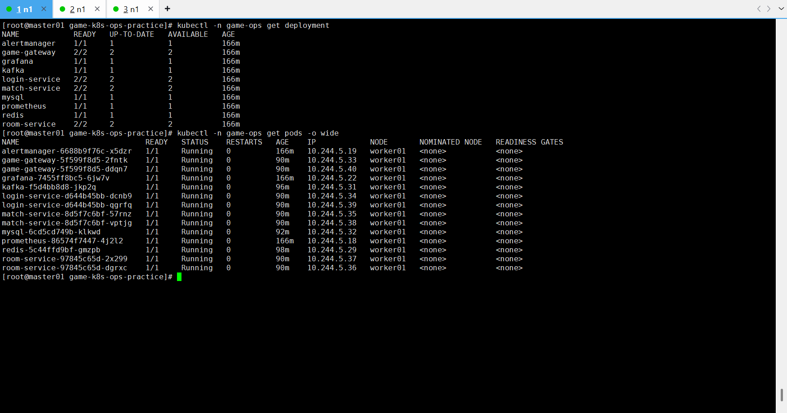
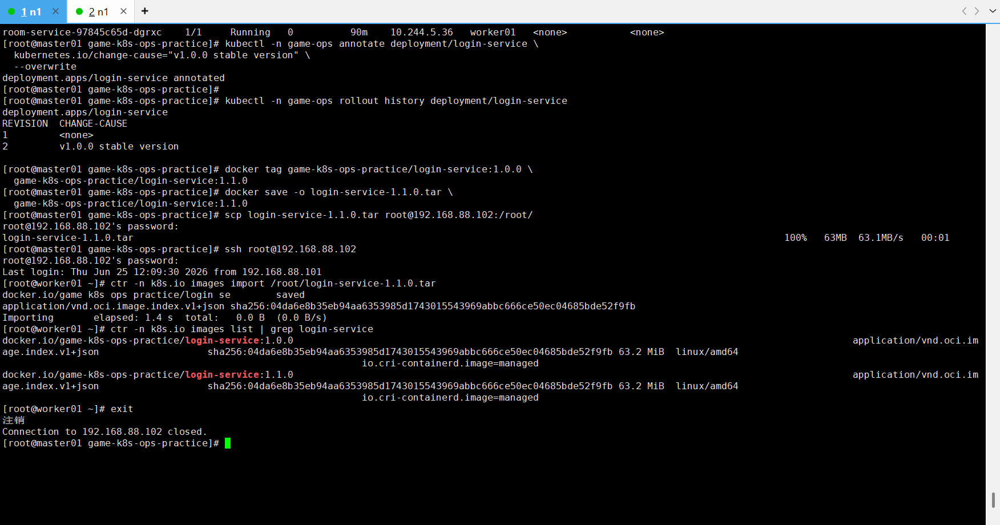
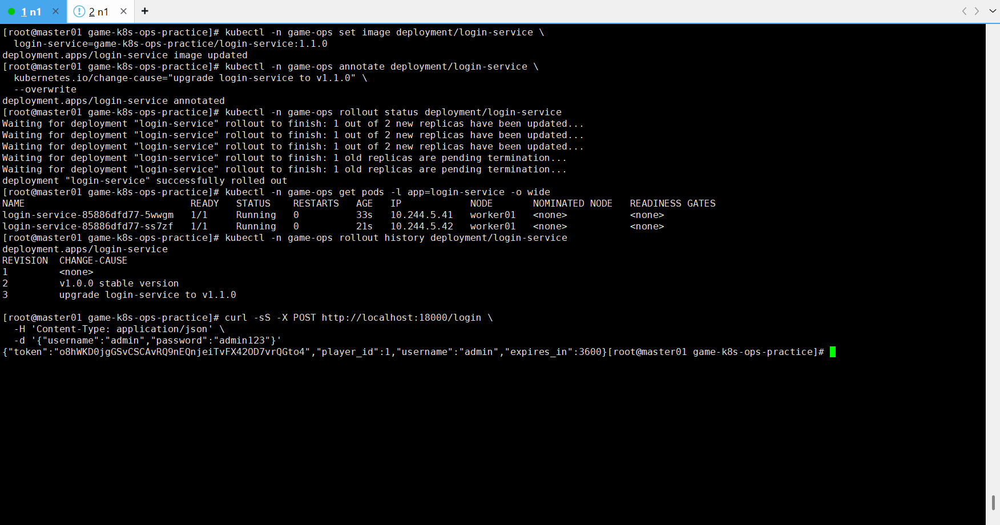

# Kubernetes 发布与回滚记录

## 一、记录说明

本文档记录 `game-k8s-ops-practice` 项目在 Kubernetes 环境中的滚动发布、错误版本发布模拟、版本回滚和业务恢复验证过程。

本阶段目标是验证 Kubernetes Deployment 的滚动更新能力，以及在发布异常版本后通过 `kubectl rollout undo` 快速回滚到上一可用版本。

本次演示对象为：

```text
login-service
```

---

## 二、发布前状态确认



### 1. 查看 Deployment 状态

执行命令：

```bash
kubectl -n game-ops get deployment
```

结果显示核心 Deployment 均处于可用状态：

```text
alertmanager    1/1
game-gateway    2/2
grafana         1/1
kafka           1/1
login-service   2/2
match-service   2/2
mysql           1/1
prometheus      1/1
redis           1/1
room-service    2/2
```

### 2. 查看 Pod 状态

执行命令：

```bash
kubectl -n game-ops get pods -o wide
```

结果显示所有核心 Pod 均为：

```text
1/1 Running
```

其中业务服务均运行在 `worker01` 节点上。

### 3. 阶段结论

发布前系统整体状态正常，具备进行滚动发布测试的条件。

---

## 三、给当前稳定版本添加发布说明



### 1. 添加 change-cause

执行命令：

```bash
kubectl -n game-ops annotate deployment/login-service \
  kubernetes.io/change-cause="v1.0.0 stable version" \
  --overwrite
```

### 2. 查看发布历史

执行命令：

```bash
kubectl -n game-ops rollout history deployment/login-service
```

结果显示：

```text
REVISION   CHANGE-CAUSE
1          <none>
2          v1.0.0 stable version
```

### 3. 说明

通过 `kubernetes.io/change-cause` 记录版本变更原因，后续可以在 `rollout history` 中更清晰地查看每次发布的目的。

---

## 四、准备 login-service 1.1.0 镜像

### 1. 本地打标签

由于本次演示重点是 Kubernetes 发布流程，因此使用当前稳定镜像重新打一个 `1.1.0` 标签作为正常发布版本。

执行命令：

```bash
docker tag game-k8s-ops-practice/login-service:1.0.0 \
  game-k8s-ops-practice/login-service:1.1.0
```

### 2. 导出镜像

执行命令：

```bash
docker save -o login-service-1.1.0.tar \
  game-k8s-ops-practice/login-service:1.1.0
```

### 3. 复制到 worker01

执行命令：

```bash
scp login-service-1.1.0.tar root@192.168.88.102:/root/
```

### 4. 导入 worker01 的 containerd

进入 worker01：

```bash
ssh root@192.168.88.102
```

导入镜像：

```bash
ctr -n k8s.io images import /root/login-service-1.1.0.tar
```

检查镜像：

```bash
ctr -n k8s.io images list | grep login-service
```

结果显示：

```text
docker.io/game-k8s-ops-practice/login-service:1.0.0
docker.io/game-k8s-ops-practice/login-service:1.1.0
```

退出 worker01：

```bash
exit
```

### 5. 阶段结论

`login-service:1.1.0` 镜像已经导入 Kubernetes 节点的 containerd 中，可以用于后续滚动发布。

---

## 五、正常滚动发布 login-service 1.1.0



### 1. 更新镜像

执行命令：

```bash
kubectl -n game-ops set image deployment/login-service \
  login-service=game-k8s-ops-practice/login-service:1.1.0
```

返回结果：

```text
deployment.apps/login-service image updated
```

### 2. 添加发布说明

执行命令：

```bash
kubectl -n game-ops annotate deployment/login-service \
  kubernetes.io/change-cause="upgrade login-service to v1.1.0" \
  --overwrite
```

返回结果：

```text
deployment.apps/login-service annotated
```

### 3. 观察滚动发布状态

执行命令：

```bash
kubectl -n game-ops rollout status deployment/login-service
```

过程输出：

```text
Waiting for deployment "login-service" rollout to finish: 1 out of 2 new replicas have been updated...
Waiting for deployment "login-service" rollout to finish: 1 old replicas are pending termination...
deployment "login-service" successfully rolled out
```

### 4. 查看新 Pod

执行命令：

```bash
kubectl -n game-ops get pods -l app=login-service -o wide
```

结果显示两个新 Pod 均为：

```text
1/1 Running
```

### 5. 查看发布历史

执行命令：

```bash
kubectl -n game-ops rollout history deployment/login-service
```

结果：

```text
REVISION   CHANGE-CAUSE
1          <none>
2          v1.0.0 stable version
3          upgrade login-service to v1.1.0
```

### 6. 验证业务接口

执行命令：

```bash
curl -sS -X POST http://localhost:18000/login \
  -H 'Content-Type: application/json' \
  -d '{"username":"admin","password":"admin123"}'
```

返回结果包含：

```json
{
  "player_id": 1,
  "username": "admin",
  "expires_in": 3600
}
```

### 7. 验证结论

`login-service` 从 `1.0.0` 成功滚动更新到 `1.1.0`，发布过程中服务可用，发布后登录接口正常。

---

## 六、模拟错误版本发布

### 1. 发布不存在的镜像版本


为了模拟错误版本发布，将 `login-service` 更新为不存在的镜像版本 `9.9.9`。

执行命令：

```bash
kubectl -n game-ops set image deployment/login-service \
  login-service=game-k8s-ops-practice/login-service:9.9.9
```

返回结果：

```text
deployment.apps/login-service image updated
```

### 2. 添加错误发布说明

执行命令：

```bash
kubectl -n game-ops annotate deployment/login-service \
  kubernetes.io/change-cause="bad release login-service v9.9.9 for rollback test" \
  --overwrite
```

返回结果：

```text
deployment.apps/login-service annotated
```

### 3. 观察发布状态

执行命令：

```bash
kubectl -n game-ops rollout status deployment/login-service --timeout=20s
```

返回结果：

```text
Waiting for deployment "login-service" rollout to finish: 1 out of 2 new replicas have been updated...
error: timed out waiting for the condition
```

### 4. 查看 login-service Pod

执行命令：

```bash
kubectl -n game-ops get pods -l app=login-service -o wide
```

结果显示：

```text
旧版本 Pod：1/1 Running
旧版本 Pod：1/1 Running
新版本 Pod：0/1 ContainerCreating
```

### 5. 查看事件

执行命令：

```bash
kubectl -n game-ops get events --sort-by=.lastTimestamp | tail -50
```

事件中可以看到新 ReplicaSet 被创建，并尝试拉取：

```text
Pulling image "game-k8s-ops-practice/login-service:9.9.9"
```

### 6. 原因分析

`login-service:9.9.9` 是一个不存在的错误版本镜像，worker01 节点中没有该镜像，远程也无法拉取，因此新版本 Pod 无法正常启动，Deployment 滚动发布超时。

### 7. 阶段结论

错误版本发布模拟成功。Kubernetes 没有直接删除所有旧版本 Pod，而是保留了已有可用副本，新的错误版本无法完成替换，这体现了 Deployment 滚动更新过程中的可用性保护。

---

## 七、执行版本回滚


### 1. 查看发布历史

执行命令：

```bash
kubectl -n game-ops rollout history deployment/login-service
```

结果：

```text
REVISION   CHANGE-CAUSE
1          <none>
2          v1.0.0 stable version
3          upgrade login-service to v1.1.0
4          bad release login-service v9.9.9 for rollback test
```

### 2. 执行回滚

执行命令：

```bash
kubectl -n game-ops rollout undo deployment/login-service
```

返回结果：

```text
deployment.apps/login-service rolled back
```

### 3. 查看回滚状态

执行命令：

```bash
kubectl -n game-ops rollout status deployment/login-service
```

返回结果：

```text
deployment "login-service" successfully rolled out
```

### 4. 查看当前镜像

执行命令：

```bash
kubectl -n game-ops get deployment login-service \
  -o jsonpath='{.spec.template.spec.containers[0].image}{"\n"}'
```

返回结果：

```text
game-k8s-ops-practice/login-service:1.1.0
```

### 5. 查看 Pod 状态

执行命令：

```bash
kubectl -n game-ops get pods -l app=login-service -o wide
```

结果显示：

```text
login-service-85886dfd77-5wwgm   1/1 Running
login-service-85886dfd77-ss7zf   1/1 Running
login-service-bbb675878-mfvqz    0/1 Terminating
```

### 6. 说明

两个 `1.1.0` 版本 Pod 已经恢复为 Running，错误版本 `9.9.9` 对应的 Pod 正在 Terminating。

---

## 八、回滚后业务验证

### 1. 执行登录接口测试

执行命令：

```bash
curl -sS -X POST http://localhost:18000/login \
  -H 'Content-Type: application/json' \
  -d '{"username":"admin","password":"admin123"}'
```

返回结果包含：

```json
{
  "player_id": 1,
  "username": "admin",
  "expires_in": 3600
}
```

### 2. 验证结论

回滚完成后，登录接口恢复正常，说明 `login-service` 已成功回滚到上一可用版本，业务链路恢复。

---

## 九、本阶段命令汇总

### 1. 查看状态

```bash
kubectl -n game-ops get deployment
kubectl -n game-ops get pods -o wide
```

### 2. 查看发布历史

```bash
kubectl -n game-ops rollout history deployment/login-service
```

### 3. 记录版本说明

```bash
kubectl -n game-ops annotate deployment/login-service \
  kubernetes.io/change-cause="v1.0.0 stable version" \
  --overwrite
```

### 4. 正常发布

```bash
kubectl -n game-ops set image deployment/login-service \
  login-service=game-k8s-ops-practice/login-service:1.1.0
```

```bash
kubectl -n game-ops rollout status deployment/login-service
```

### 5. 错误版本发布

```bash
kubectl -n game-ops set image deployment/login-service \
  login-service=game-k8s-ops-practice/login-service:9.9.9
```

```bash
kubectl -n game-ops rollout status deployment/login-service --timeout=20s
```

### 6. 查看事件

```bash
kubectl -n game-ops get events --sort-by=.lastTimestamp | tail -50
```

### 7. 回滚

```bash
kubectl -n game-ops rollout undo deployment/login-service
kubectl -n game-ops rollout status deployment/login-service
```

### 8. 验证当前镜像

```bash
kubectl -n game-ops get deployment login-service \
  -o jsonpath='{.spec.template.spec.containers[0].image}{"\n"}'
```

### 9. 验证业务

```bash
curl -sS -X POST http://localhost:18000/login \
  -H 'Content-Type: application/json' \
  -d '{"username":"admin","password":"admin123"}'
```

---

## 十、本阶段总结

本阶段完成了 Kubernetes 发布与回滚演示，验证了以下能力：

1. 使用 Deployment 管理业务服务副本。
2. 使用 `kubectl set image` 触发滚动发布。
3. 使用 `kubectl rollout status` 观察发布状态。
4. 使用 `kubectl rollout history` 查看版本历史。
5. 使用 `kubernetes.io/change-cause` 记录发布原因。
6. 使用错误镜像版本模拟异常发布。
7. 使用 `kubectl get events` 查看发布异常原因。
8. 使用 `kubectl rollout undo` 回滚到上一可用版本。
9. 回滚后通过业务接口验证服务恢复。

最终发布回滚链路如下：

```text
稳定版本：login-service:1.0.0
  ↓
正常发布：login-service:1.1.0
  ↓
错误发布：login-service:9.9.9
  ↓
发布失败：新 Pod 无法就绪，rollout status 超时
  ↓
执行回滚：kubectl rollout undo
  ↓
恢复版本：login-service:1.1.0
  ↓
业务验证：/login 接口成功返回 token
```

至此，项目已经完成从 Docker Compose、本地业务验证、监控告警、Kubernetes 部署、Kubernetes 排查到发布回滚的完整运维实践闭环。