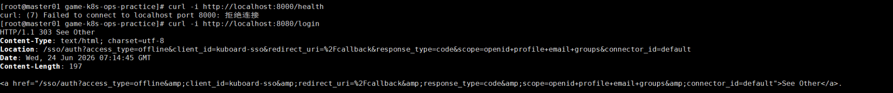

# 故障场景：宿主机 8080 端口被 Kuboard 占用

## 现象

执行健康检查时，`http://localhost:8080/health` 返回 `404`；访问业务接口却收到 Kuboard 的 SSO 跳转：

```text
HTTP/1.1 303 See Other
Location: /sso/auth?access_type=offline&client_id=kuboard-sso...
```



## 影响范围

- 项目 Nginx 无法绑定宿主机 `8080`。
- 用户访问到了 Kuboard，而不是游戏业务网关。
- 健康检查和所有经 Nginx 转发的业务请求失败。
- 后端服务即使正常，也无法通过预期入口访问。

## 排查步骤

1. 检查宿主机监听端口。
2. 查看 Docker 容器的端口映射。
3. 直接请求 `8080`，根据响应头识别实际服务。
4. 对照 `docker-compose.yml` 确认端口映射冲突。

## 关键命令

```bash
ss -lntp | grep ':8080'

docker ps --format "table {{.Names}}\t{{.Status}}\t{{.Ports}}" \
  | grep -E "8080|8000|8001|8002|8003|kuboard|game|gateway|login|match|room|nginx"

curl -i http://localhost:8080/login
```

## 根因

Kuboard 容器已占用宿主机 `8080`，而项目 Nginx 同样配置了 `8080:80`。请求实际进入 Kuboard，项目入口无法使用该端口。

## 恢复方案

将 Nginx 宿主机端口改为未占用的 `18080`：

```yaml
ports:
  - "18080:80"
```

重新创建 Compose 服务：

```bash
docker compose down
docker compose up -d
curl http://localhost:18080/health
```

同时将健康检查脚本或环境变量中的入口地址调整为 `http://localhost:18080`。

## 复盘总结

- 部署前应检查目标端口，而不是仅依赖 Compose 启动结果。
- `404` 不一定表示目标应用路由不存在，也可能访问了错误服务。
- 多套平台共用宿主机时，应建立端口规划或统一使用反向代理和域名路由。

