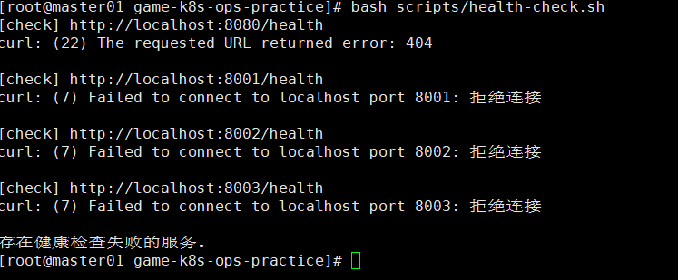

# 故障场景：业务服务缺少 cryptography 依赖

## 现象

执行 `docker compose up -d` 后，`game-gateway` 处于 `Restarting` 或 `unhealthy`，Nginx 因依赖服务未就绪而无法正常启动。日志出现：

```text
RuntimeError: 'cryptography' package is required for
sha256_password or caching_sha2_password auth methods
```



## 影响范围

- FastAPI 服务在 lifespan 初始化阶段退出。
- Gateway、登录、匹配和房间服务无法正常提供接口。
- Nginx 入口不可用。
- 健康检查中的 `8001`、`8002`、`8003` 出现拒绝连接。

## 排查步骤

1. 查看 Compose 服务状态，定位反复重启或不健康的容器。
2. 查看 `game-gateway` 启动日志。
3. 沿异常堆栈定位到 `aiomysql.create_pool()`。
4. 核对 MySQL 版本、认证插件及 Python 镜像依赖。

## 关键命令

```bash
docker compose ps

docker logs --tail=200 game-k8s-ops-practice-game-gateway-1

docker compose logs --tail=200 \
  game-gateway login-service match-service room-service

grep -n cryptography requirements.txt
```

## 根因

MySQL 8.4 使用 `caching_sha2_password` 认证。`aiomysql/PyMySQL` 处理该认证方式时需要 `cryptography`，但业务镜像未安装此依赖，导致服务启动阶段连接 MySQL 失败。

## 恢复方案

在 `requirements.txt` 中加入固定版本的 `cryptography` 依赖，然后重建所有业务镜像：

```text
cryptography==<经过验证的版本>
```

```bash
docker compose build --no-cache \
  game-gateway login-service match-service room-service

docker compose up -d --force-recreate \
  game-gateway login-service match-service room-service

docker compose up -d nginx
bash scripts/health-check.sh
```

## 复盘总结

- 数据库驱动安装成功不代表覆盖了所有认证方式的可选依赖。
- 应在镜像构建后增加启动或数据库连接测试。
- 四个服务共享依赖时，应统一更新并重建，避免镜像依赖不一致。
- Python 依赖应固定版本并纳入持续集成检查。

