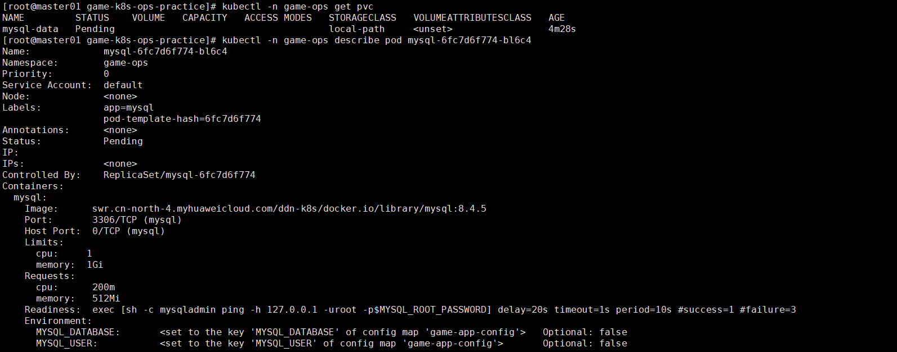
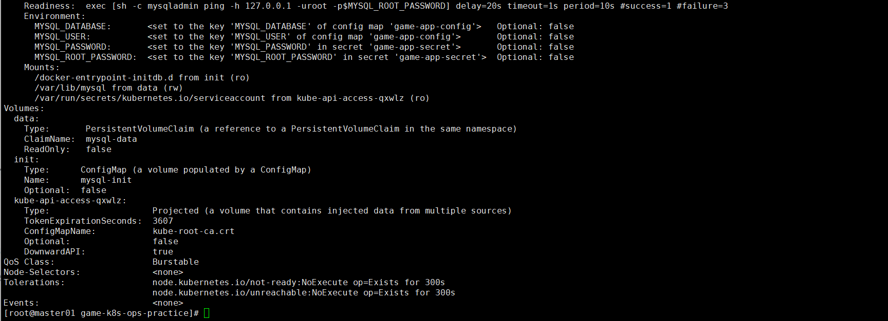
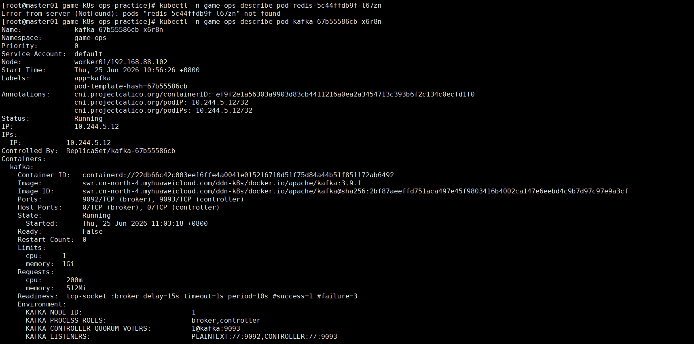
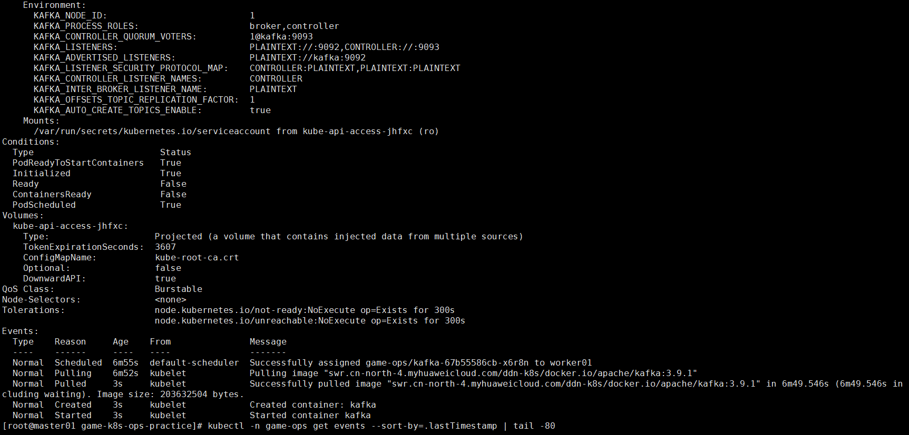
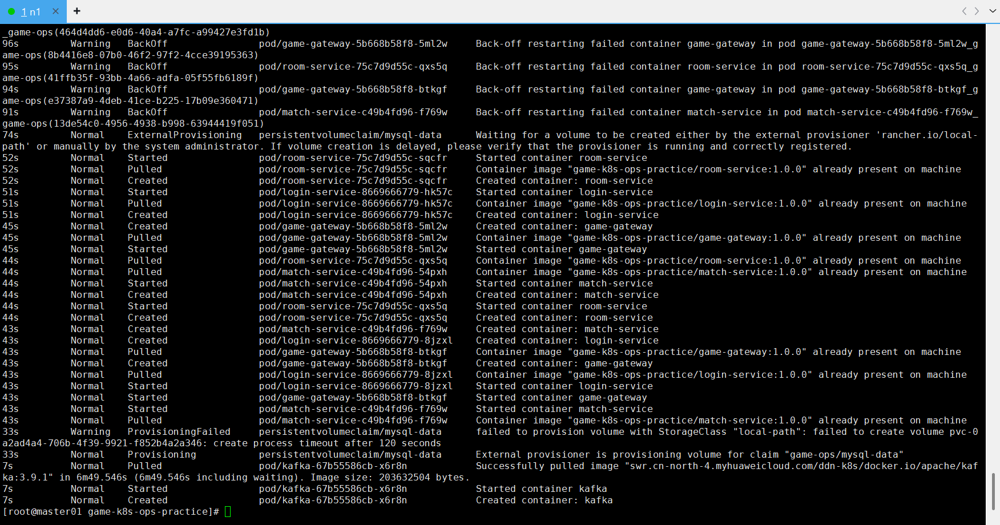

# 故障场景：MySQL PVC 长期 Pending

## 现象

MySQL PVC 和 Pod 一直处于 `Pending`：

```text
mysql-data   Pending   local-path
```











## 影响范围

- MySQL 无法启动。
- 四个业务服务启动时无法连接 MySQL，可能进入 `CrashLoopBackOff`。
- 登录、房间等依赖持久化数据的接口不可用。
- 整条业务链路的健康检查降级或失败。

## 排查步骤

1. 查看 PVC、PV、StorageClass 状态。
2. Describe PVC 和 MySQL Pod。
3. 按时间排序查看 Namespace 事件。
4. 检查 local-path provisioner Pod 和日志。
5. 判断是容量、访问模式、调度还是 provisioner 执行超时。

## 关键命令

```bash
kubectl -n game-ops get pvc,pv
kubectl get storageclass

kubectl -n game-ops describe pvc mysql-data
kubectl -n game-ops describe pod -l app=mysql

kubectl -n game-ops get events --sort-by=.lastTimestamp | tail -80

kubectl -n local-path-storage get pods
kubectl -n local-path-storage logs deployment/local-path-provisioner
```

关键事件：

```text
failed to provision volume with StorageClass "local-path":
failed to create volume ... create process timeout after 120 seconds
```

## 根因

MySQL PVC 依赖 `local-path` StorageClass，但当前环境的 local-path provisioner 创建本地卷超时，PVC 无法绑定，MySQL Pod 因没有可用卷而无法调度和启动。

## 恢复方案

练习环境临时方案：将 MySQL 数据卷改为 `emptyDir`，优先跑通业务链路。

```yaml
volumes:
  - name: data
    emptyDir: {}
```

```bash
kubectl -n game-ops delete pod -l app=mysql
kubectl -n game-ops delete pvc mysql-data
kubectl apply -f k8s/infra.yaml
kubectl -n game-ops get pods -l app=mysql
```

生产或长期环境方案：修复 provisioner、使用可靠 CSI StorageClass，或迁移到外部托管 MySQL。生产环境不能使用 `emptyDir` 保存数据库数据。

## 复盘总结

- Pod `Pending` 时优先查事件和调度条件，而不是反复重启 Pod。
- 数据库故障可能向上游放大为多个业务服务 CrashLoop。
- 临时恢复方案必须明确数据丢失风险和适用边界。
- 上线前应验证 StorageClass 动态供给和回收流程。

