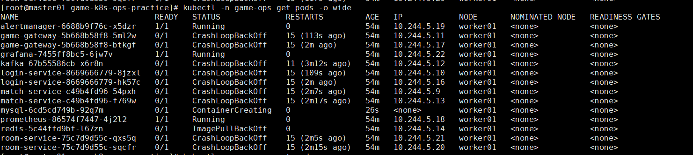

# 故障场景：Redis 镜像拉取失败

## 现象

Redis Pod 处于 `ErrImagePull` 或 `ImagePullBackOff`：

```text
Failed to pull image ".../redis:7.4.2-alpine": not found
Error: ErrImagePull
Error: ImagePullBackOff
```



## 影响范围

- 登录会话和玩家在线状态无法读写。
- 匹配队列和房间临时状态不可用。
- 四个业务服务连接 Redis 失败，健康检查降级或启动失败。

## 排查步骤

1. 查看 Redis Pod 状态。
2. Describe Pod，读取镜像拉取事件。
3. 确认 YAML 中的完整镜像名和标签。
4. 在节点的 containerd `k8s.io` 命名空间中检查镜像。
5. 判断是镜像不存在、仓库不可达、认证失败还是节点未导入。

## 关键命令

```bash
kubectl -n game-ops get pods -l app=redis
kubectl -n game-ops describe pod -l app=redis
kubectl -n game-ops get events --sort-by=.lastTimestamp | tail -50

ctr -n k8s.io images list | grep redis
```

## 根因

Kubernetes 清单引用的 Redis 镜像地址无法从远程仓库正常拉取，并且工作节点的 containerd 中不存在同名镜像。

## 恢复方案

将本地已有镜像重新标记为清单所需名称，导出并导入工作节点：

```bash
docker tag redis:7.4.2-alpine \
  <K8S_YAML中的完整Redis镜像名>

docker save -o redis-k8s.tar \
  <K8S_YAML中的完整Redis镜像名>

scp redis-k8s.tar root@<worker-ip>:/root/
```

在工作节点执行：

```bash
ctr -n k8s.io images import /root/redis-k8s.tar
ctr -n k8s.io images list | grep redis
```

重建 Pod 并验证：

```bash
kubectl -n game-ops delete pod -l app=redis
kubectl -n game-ops get pods -l app=redis -w
```

## 复盘总结

- Docker 和 containerd 使用不同镜像存储，本地 Docker 有镜像不代表 K8s 节点可用。
- 导入镜像时名称和标签必须与 Deployment 完全一致。
- 长期方案应使用所有节点均可访问的可靠镜像仓库。
- `imagePullPolicy: IfNotPresent` 只能复用同名本地镜像，不能修复错误镜像名。

