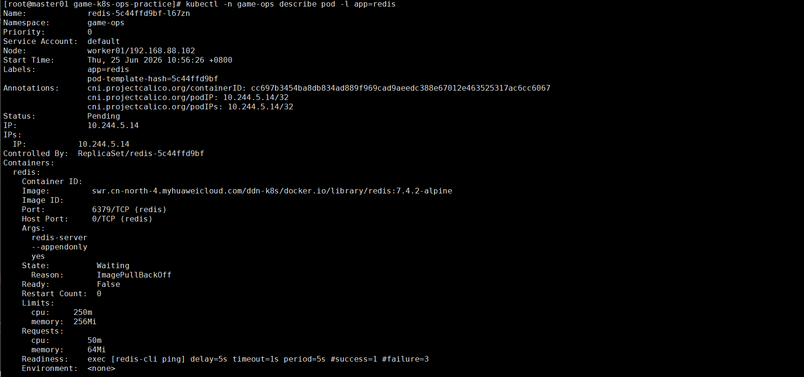
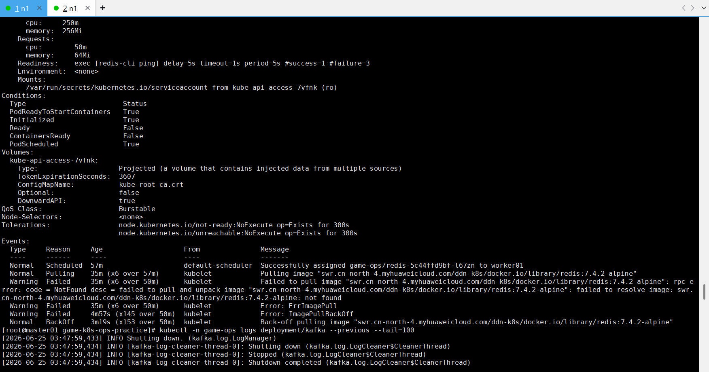
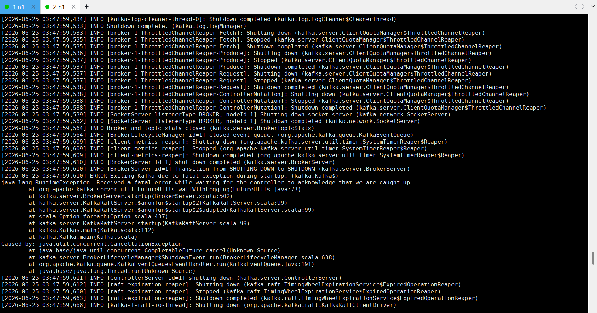
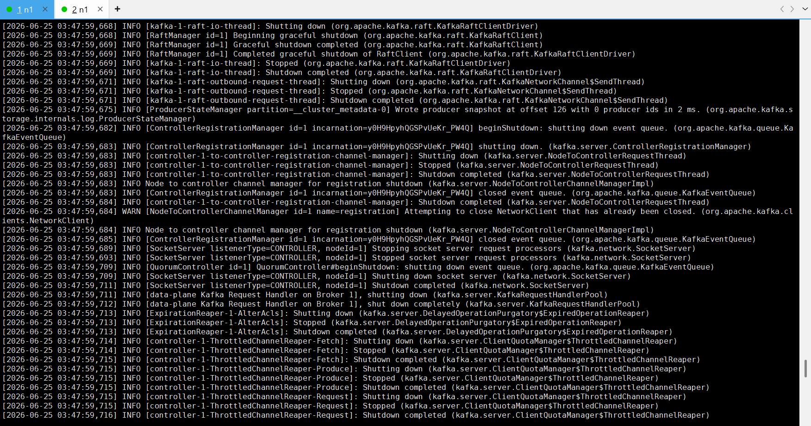
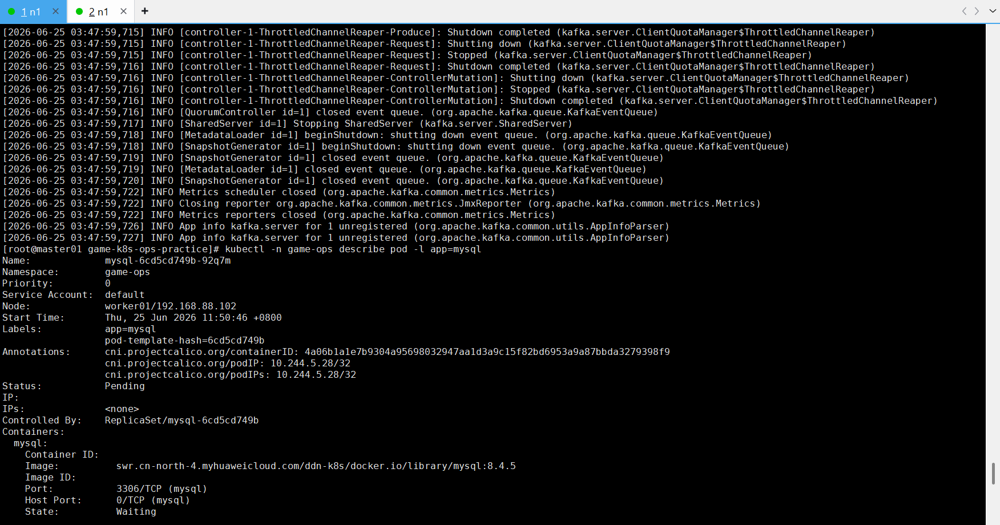
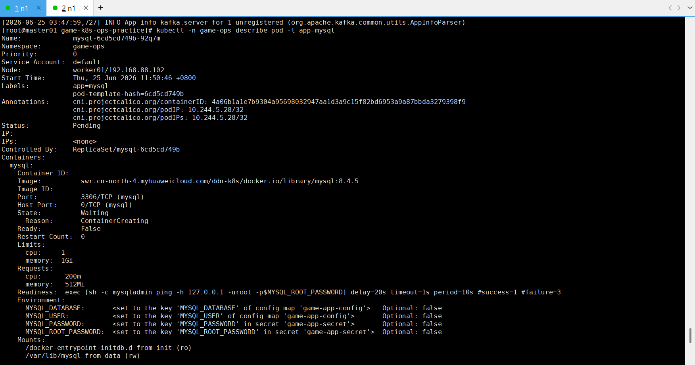
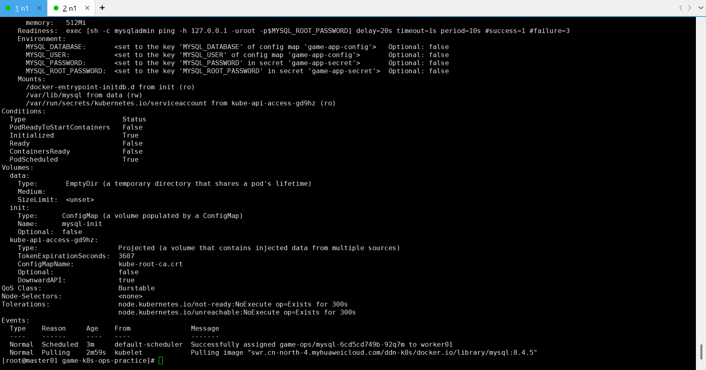
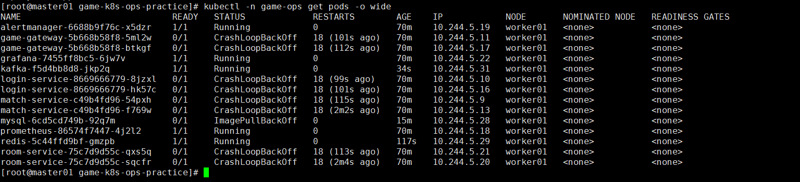

# 故障场景：MySQL 镜像拉取失败

## 现象

解决 PVC 问题后，MySQL Pod 仍处于 `ImagePullBackOff`，事件显示远程镜像拉取失败。

















## 影响范围

- MySQL 容器不能创建。
- 用户、登录记录和房间记录不可访问。
- 业务服务因数据库依赖不可用而启动失败或健康检查降级。

## 排查步骤

1. 区分 Pod 是因 PVC Pending 还是镜像拉取失败。
2. Describe MySQL Pod，检查 `Pulling`、`Failed`、`BackOff` 事件。
3. 核对镜像仓库、路径和标签。
4. 在工作节点检查 containerd 是否已有同名镜像。
5. 测试节点到镜像仓库的网络和认证。

## 关键命令

```bash
kubectl -n game-ops get pods -l app=mysql
kubectl -n game-ops describe pod -l app=mysql
kubectl -n game-ops get events --sort-by=.lastTimestamp | tail -80

ctr -n k8s.io images list | grep mysql
```

## 根因

Kubernetes 节点未预先保存清单指定的 MySQL 镜像，远程镜像仓库拉取不稳定或失败。即使存储问题已解决，容器仍无法创建。

## 恢复方案

将本地 MySQL 镜像标记为清单中使用的完整名称并导入工作节点：

```bash
docker tag mysql:8.4.5 \
  <K8S_YAML中的完整MySQL镜像名>

docker save -o mysql-k8s.tar \
  <K8S_YAML中的完整MySQL镜像名>

scp mysql-k8s.tar root@<worker-ip>:/root/
```

工作节点执行：

```bash
ctr -n k8s.io images import /root/mysql-k8s.tar
ctr -n k8s.io images list | grep mysql
```

重建并观察：

```bash
kubectl -n game-ops delete pod -l app=mysql
kubectl -n game-ops get pods -l app=mysql -w
kubectl -n game-ops logs deployment/mysql --tail=100
```

## 复盘总结

- 一个 Pod 可能先后暴露多个独立故障，修复 PVC 后仍需重新观察事件。
- 镜像导入成功后必须核对完整镜像引用，而不只是仓库中是否出现 `mysql`。
- 生产环境应使用稳定仓库、镜像拉取凭据和镜像同步策略。
- 应将基础镜像可达性检查纳入部署前置条件。

