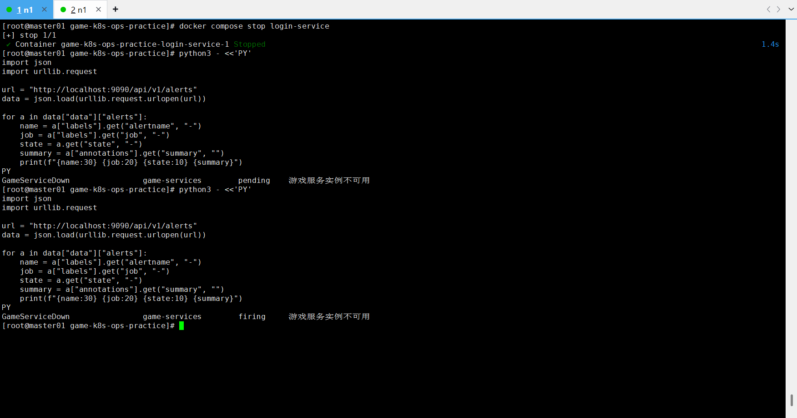
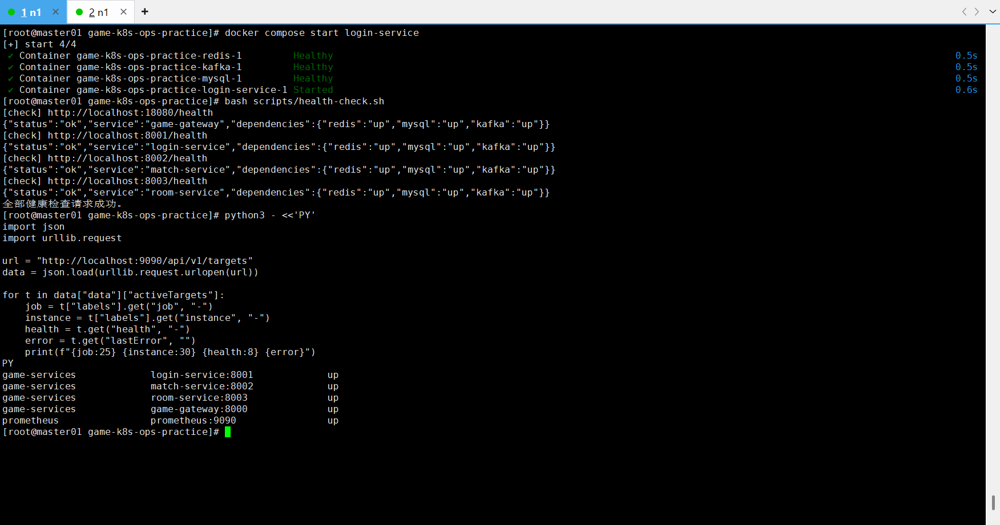

# 故障场景：login-service 不可用

## 现象

主动停止 `login-service` 后：

- 登录接口不可用。
- Prometheus Target `login-service:8001` 变为 `down`。
- `GameServiceDown` 告警先进入 `pending`，持续达到规则时间后进入 `firing`。



## 影响范围

- 新玩家无法登录，已有登录会话是否受影响取决于调用链设计。
- Gateway 的 `/login` 请求返回上游错误。
- 匹配和房间服务本身仍可能正常运行。
- 监控系统产生服务不可用告警。

## 排查步骤

1. 从用户现象确认登录接口失败。
2. 查看 Compose 服务状态和 login-service 日志。
3. 检查 `/health` 和 Prometheus Target。
4. 查看 Prometheus 告警状态是 `pending` 还是 `firing`。
5. 检查 MySQL、Redis、Kafka，判断是服务本身停止还是依赖故障。

## 关键命令

注入故障：

```bash
docker compose stop login-service
docker compose ps
curl -i http://localhost:18080/login
```

查询告警：

```bash
curl -s http://localhost:9090/api/v1/alerts
curl -s http://localhost:9090/api/v1/targets
```

排查日志和依赖：

```bash
docker compose logs --tail=200 login-service
docker compose ps mysql redis kafka
bash scripts/health-check.sh
```

## 根因

该场景是主动故障注入：人为停止 `login-service` 容器，用于验证服务不可用时的业务影响、Prometheus 抓取状态和告警状态流转。

## 恢复方案

启动服务并验证：

```bash
docker compose start login-service
docker compose ps login-service
bash scripts/health-check.sh
```



确认 Prometheus Targets 全部恢复为 `up`，告警随后回到 `inactive`。

## 复盘总结

- `pending` 表示条件已满足但持续时间不足，`firing` 才是正式触发。
- 告警恢复验证与告警触发验证同样重要。
- 应明确单服务故障的业务边界，避免把所有接口失败都归因于网关。
- 演练应记录检测时间、告警持续时间和恢复时间。

