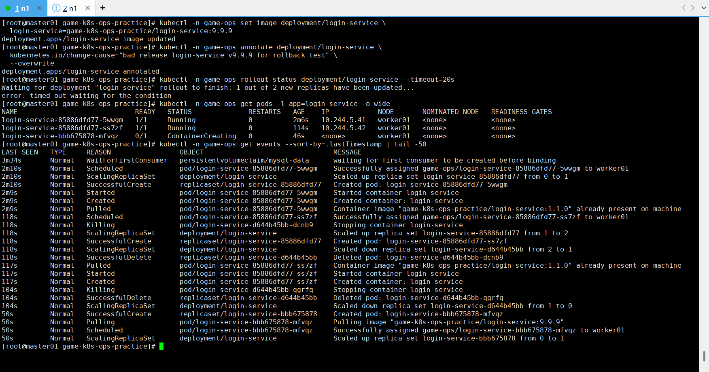
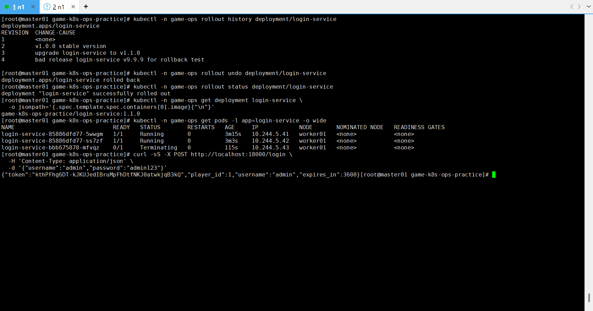

# 故障场景：错误镜像版本发布与回滚

## 现象

将 `login-service` 发布为不存在的 `9.9.9` 镜像后，Deployment rollout 超时，新 Pod 无法就绪：

```text
Waiting for deployment "login-service" rollout to finish...
error: timed out waiting for the condition
```



## 影响范围

- 新版本无法完成发布。
- 新 ReplicaSet 的 Pod 进入 `ContainerCreating`、`ErrImagePull` 或 `ImagePullBackOff`。
- 因滚动更新策略保留旧可用副本，登录服务可能仍能提供部分或全部流量。
- 如果 `maxUnavailable`、副本数或探针配置不合理，可能造成完整中断。

## 排查步骤

1. 查看 rollout status，确认发布超时。
2. 查看 Deployment、ReplicaSet 和新旧 Pod。
3. Describe 新 Pod 并查看事件。
4. 核对当前镜像和 rollout history。
5. 判断是镜像不存在、探针失败还是应用启动异常。

## 关键命令

故障注入：

```bash
kubectl -n game-ops set image deployment/login-service \
  login-service=game-k8s-ops-practice/login-service:9.9.9

kubectl -n game-ops annotate deployment/login-service \
  kubernetes.io/change-cause="bad release login-service v9.9.9 for rollback test" \
  --overwrite
```

排查：

```bash
kubectl -n game-ops rollout status deployment/login-service --timeout=20s
kubectl -n game-ops get pods -l app=login-service -o wide
kubectl -n game-ops get rs -l app=login-service
kubectl -n game-ops get events --sort-by=.lastTimestamp | tail -50
kubectl -n game-ops rollout history deployment/login-service
```

## 根因

发布使用了不存在的 `login-service:9.9.9`。工作节点没有该镜像，远程仓库也无法拉取，因此新 Pod 无法启动，Deployment 无法达到期望副本数。

## 恢复方案

回滚到上一可用 revision：

```bash
kubectl -n game-ops rollout undo deployment/login-service
kubectl -n game-ops rollout status deployment/login-service

kubectl -n game-ops get deployment login-service \
  -o jsonpath='{.spec.template.spec.containers[0].image}{"\n"}'
```



回滚后验证登录接口：

```bash
curl -sS -X POST http://localhost:18000/login \
  -H 'Content-Type: application/json' \
  -d '{"username":"admin","password":"admin123"}'
```

## 复盘总结

- 发布前应确认镜像已推送或已导入所有目标节点。
- `rollout status`、Pod 事件和 rollout history 是发布排障的核心证据。
- 合理的滚动更新参数和 readiness Probe 可以保护旧版本可用性。
- 回滚完成不代表故障闭环，必须执行核心业务接口冒烟测试。
- 数据库破坏性变更不能仅靠 Deployment 回滚解决，需要独立兼容策略。

